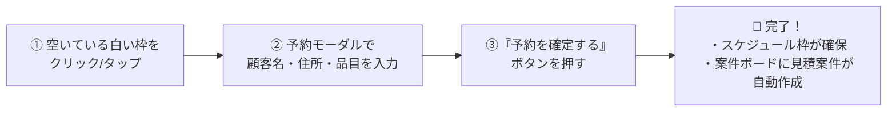
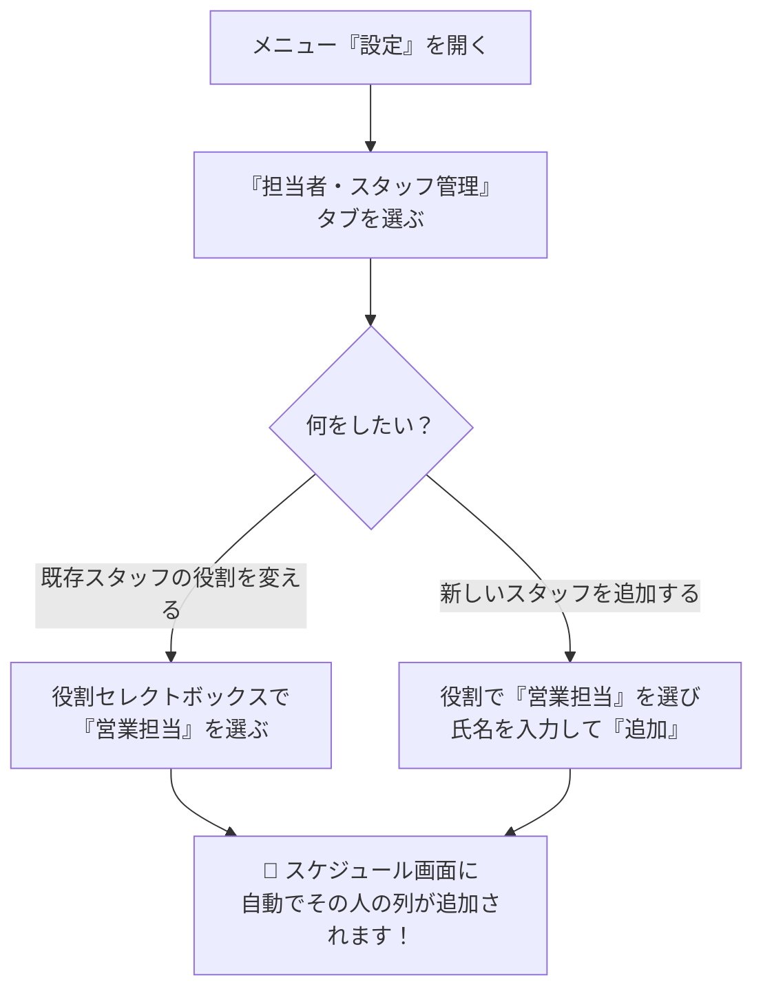
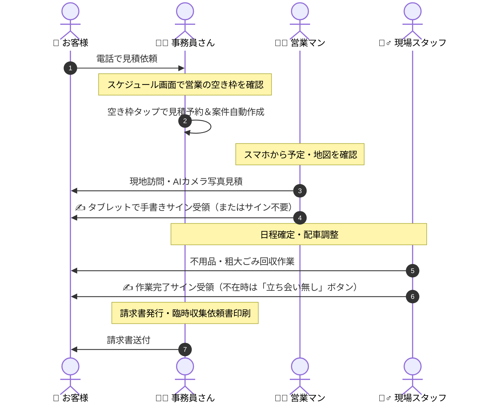

# Clean KENKOU ERP やさしい操作マニュアル（第3版 2026年最新版）
**有限会社クリーン健康社 専用業務支援システム**

こんにちは！  
このマニュアルでは、クリーン健康社の専用システム「**Clean KENKOU ERP**」の使い方を、図やイラストをまじえて、どなたでも迷わず使えるようにやさしい言葉で分かりやすくご案内します。

---

## 🌟 目次
1. [Clean KENKOU ERP ってどんなシステム？](#1-clean-kenkou-erp-ってどんなシステム)
2. [画面の開き方と表示の切り替え（パソコン・タブレット・スマホ）](#2-画面の開き方と表示の切り替え)
3. [【新機能✨】📅 営業スケジュール ＆ 見積枠予約カレンダー](#3-新機能-営業スケジュール--見積枠予約カレンダー)
4. [【新機能✨】👥 担当者・スタッフ管理（営業担当の増やし方）](#4-新機能-担当者スタッフ管理営業担当の増やし方)
5. [【新機能✨】🔒 自分のパスワードを変更する方法](#5-新機能-自分のパスワードを変更する方法)
6. [【新機能✨】🎯 ダッシュボードで「自分の担当案件」だけを見る](#6-新機能-ダッシュボードで自分の担当案件だけを見る)
7. [おさらい：お仕事全体のやさしい流れ（受付〜作業〜請求）](#7-おさらいお仕事全体のやさしい流れ)
8. [困ったときの Q&A（よくある質問）](#8-困ったときの-qaよくある質問)

---

## 1. Clean KENKOU ERP ってどんなシステム？

```
  【 事務所のパソコン 】                 【 外出先・現場のタブレット＆スマホ 】
    👩‍💼 事務員さん                         👨‍💼 営業マン            👷‍♂️ 現場スタッフ
        │                                     │                       │
        ▼                                     ▼                       ▼
  ┌────────────────────────────────────────────────────────────────────────┐
  │                 ☁️ Clean KENKOU ERP（クラウド安全同期）                  │
  │  ・電話受付から見積予約      ・営業スケジュール確認    ・電子サイン受領         │
  │  ・案件のカンバン管理        ・外出先マップ＆電話連動  ・作業完了報告＆指示書印刷 │
  └────────────────────────────────────────────────────────────────────────┘
```

事務所のパソコンでも、現場のタブレットでも、外出中の営業マンのスマホでも、**全員が同じ最新の情報をリアルタイムに共有**できるシステムです。
電話の折り返し待ちや、紙の指示書の紛失、予定の重複（ダブルブッキング）をまるごと防ぎます。

---

## 2. 画面の開き方と表示の切り替え

### 💻 パソコンで使うとき
ブラウザ（Google ChromeやMicrosoft Edgeなど）でシステムを開きます。
画面の上にメニューが横並びで表示されます。

### 📱 タブレット・スマホで使うとき
画面の**一番下（フッター）**に、押しやすい大きなボタン（メニュー）が並びます。

```
┌────────────────────────────────────────────────────────┐
│  【携帯・タブレットの画面イメージ】                    │
│                                                        │
│  （ここに案件やスケジュールが表示されます）             │
│                                                        │
├────────────────────────────────────────────────────────┤
│  [📅 スケジュール]  [📋 案件一覧]  [＋ 受付]  [⚙️ 設定] │  ◀ 画面の一番下に常時表示
└────────────────────────────────────────────────────────┘
```

> [!TIP]
> **ワンタップで「携帯・タブレット表示」と「PC表示」を切り替えられます！**  
> 画面の右上（スタッフお名前の左側）にある **「📱 携帯・タブレット表示へ」 / 「💻 PC表示へ」** ボタンを押すと、タブレットを縦向き・横向きにしたときなど、お好みに合わせていつでも表示を切り替えられます。

---

## 3. 【新機能✨】📅 営業スケジュール ＆ 見積枠予約カレンダー

お客様から「見積もりに来てほしい！」とお電話をいただいたとき、営業マンにわざわざ電話で「○日の午後空いてる？」と確認しなくても、**画面を見るだけでリアルタイムの空き状況がひと目でわかる**ようになりました！

```
                     【 営業タイムライン（日別ビュー） 】
 
 時間    廣田 龍之介 (営業)      原口 真治 (営業)        新任営業さん (営業)
──────  ────────────────────  ────────────────────  ────────────────────
 9:00   [ 🟦 外出・移動 ]      [  ★ 白い空き枠  ]    [  ★ 白い空き枠  ]
──────  ────────────────────  ────────────────────  ────────────────────
10:00   [ 🟧 山田様 見積 ]     [  ★ 白い空き枠  ]    [ 🟪 社内打合せ ]
        （案件詳細・地図連動）
──────  ────────────────────  ────────────────────  ────────────────────
11:00   [  ★ 白い空き枠  ]    [ 🟧 佐藤様 見積 ]     [  ★ 白い空き枠  ]
```

### 🎈 主なポイント
1. **営業担当者だけがずらりと並びます**
   - 事務員さんや現場作業員さんは除外され、**「営業担当」のスタッフだけ**が並びます。
   - 営業スタッフが増えたり変わったりしても、自動的に列が増減します。
2. **色の違いで予定の種類がひと目でわかります**
   - 🟧 **オレンジ色（見積訪問アポ）**: お客様宅への下見・見積予約です（案件と連動）。
   - 🟦 **青色（外出・移動）**: 役所や移動時間です。
   - 🟪 **紫色（打合せ・会議）**: 社内ミーティングや商談です。
   - 🟩 **緑色（現場作業・立会い）**: 回収の立会いや作業です。
   - ⬜ **白色（空き枠）**: 予約が入っていない空いている時間です！

---

### 📝 空き枠をタップして見積予約をとる手順（超かんたん3ステップ）



1. **空いている時間枠（白いマス）をタップします**
   - その営業マンの名前と、日付・時間が自動でセットされた予約画面が開きます。
2. **お客様のお名前・電話番号・ご住所を入力します**
   - 既存のお客様なら検索して選ぶだけで住所や電話番号が自動で入ります。
   - 初めてのお客様でもその場で入力するだけで新規登録されます。
3. **「予約を確定する」ボタンを押します**
   - これだけで、**カレンダーに見積訪問アポが登録され、同時に案件一覧（かんばんボード）の「顧客検討（見積対応）」に新しい案件カードが自動作成**されます！

---

### 🚗 外出先・現場の営業マン向け便利機能（スマホ・タブレット連動）

登録されている予定カードをタップすると、以下のボタンがすぐ使えます：

- **📍 Googleマップで案内**: タップするとナビが起動し、お客様宅までの道順をすぐに案内してくれます。
- **📞 電話をかける**: お客様の電話番号へワンタップで発信できます。
- **📋 案件の詳細を見る**: 過去のやり取りや現場写真、回収品目リストをその場で確認・更新できます。

---

## 4. 【新機能✨】👥 担当者・スタッフ管理（営業担当の増やし方）

「新しく営業スタッフが入った」「現場作業員だったスタッフが営業も兼ねるようになった」という場合も、管理画面からいつでも変更できます。



### 営業担当にする手順
1. メニューの **「⚙️ 設定」** を開きます。
2. 上のタブから **「👥 担当者・スタッフ管理」** を選びます。
3. 一覧にスタッフの名前が並んでいます。営業スケジュールに載せたい人の「役割」欄で **「営業担当」** を選びます。
   - 新しいスタッフを追加する場合は、上の追加フォームで役割を **「営業担当」** にして、名前を入れて「追加」を押します。
4. **「📅 スケジュール」画面に戻ると、そのスタッフのスケジュール列が自動で増えています！**

> [!NOTE]
> スケジュール画面に載せたくないスタッフ（事務専門や現場専門の方）は、役割を「事務担当」や「現場作業員」にしておけば、スケジュール列には表示されずスッキリ保てます。

---

## 5. 【新機能✨】🔒 自分のパスワードを変更する方法

スタッフそれぞれが、自分の使いやすいパスワードにいつでも自由に変更できます。

```
┌────────────────────────────────────────────────────────┐
│  画面右上のお名前（アイコン）をクリック               │
│                                                        │
│  ┌───────────────────────────────┐                     │
│  │ 👤 廣田 龍之介 (営業担当)     │                     │
│  │ ✉️ hirota@kenkou.co.jp        │                     │
│  │ ───────────────────────────── │                     │
│  │ 🔑 パスワードを変更する       │ ◀ ここをクリック    │
│  │ 🚪 ログアウト                 │                     │
│  └───────────────────────────────┘                     │
└────────────────────────────────────────────────────────┘
```

1. パソコンでもタブレットでも、画面右上にある **自分の名前（アイコン）** をタップします。
2. 出てきたメニューから **「🔑 パスワードを変更する」** をタップします。
3. 新しいパスワード（半角英数字6文字以上）を2回入力して、**「パスワードを変更する」** を押せば完了です！

---

## 6. 【新機能✨】🎯 ダッシュボードで「自分の担当案件」だけを見る

案件一覧（ダッシュボードのかんばんボード）に案件がたくさん並んでいても、**自分の担当タスクだけを1秒で絞り込める**ようになりました。

```
┌─────────────────────────────────────────────────────────────────────────┐
│  ダッシュボード                                                         │
│                                                                         │
│  [ 全ステータス ▼ ]   [ 担当者: 廣田 龍之介 (営業担当) ▼ ] ◀ ここで選ぶ  │
│                                                                         │
│  ┌───────────────┐ ┌───────────────┐ ┌───────────────┐ ┌───────────────┐ │
│  │ 未着手 (0件)  │ │ 顧客検討 (3件)│ │ 日程確定 (1件)│ │ 作業完了 (5件)│ │
│  │               │ │ 廣田さんの案件│ │ 廣田さんの案件│ │ 廣田さんの案件│ │
│  └───────────────┘ └───────────────┘ └───────────────┘ └───────────────┘ │
└─────────────────────────────────────────────────────────────────────────┘
```

- 画面上部にある **「担当者」セレクトボックス** から自分の名前を選びます。
- 自分以外の案件が隠れ、**自分が今日対応すべき案件だけ**がパッと表示されます。
- 「全スタッフ表示」に戻せば、社内全体の動きをいつでも俯瞰できます。

---

## 7. おさらい：お仕事全体のやさしい流れ

電話受付から、作業完了・請求書の発行までの全体フローです。



### ✍️ 電子サインの「3つの安心モード」
現場の状況に合わせて、ワンタップで切り替えられます：
1. **✍️ 手書き電子サイン**: お客様がご在宅のとき、画面に指やタッチペンでサインをいただきます。
2. **📦 立ち会い無し（不在回収）**: 玄関先や車庫への置き回収で不在のとき、ボタンを1回押すだけで『立ち会い無し（不在回収）』と帳票に自動印字されます。
3. **📝 サイン不要（電話承諾など）**: 電話で事前ご了承をいただいている場合は『サイン不要（事前承諾済）』と正しく印字されます。

---

## 8. 困ったときの Q&A（よくある質問）

### Q1. スケジュール画面に特定の営業スタッフが表示されません！
**A.** そのスタッフの役割が「営業担当」になっていない可能性があります。  
メニューの「設定」→「担当者・スタッフ管理」を開き、その方の役割を **「営業担当」** に変更してください。変更すると即座にスケジュール画面に列が表示されます。

### Q2. タブレットでスケジュール画面はどこから開きますか？
**A.** 画面の**一番下にある固定メニューの一番左端**に「📅 スケジュール」というカレンダーのアイコンがあります。ここをタップしてください。  
もし見当たらない場合は、画面右上の「📱 携帯・タブレット表示へ」を押して表示を切り替えてみてください。

### Q3. 間違えて見積予約を入れてしまいました。消せますか？
**A.** はい、消せます。  
消したい予定カードをタップして詳細画面を開き、右下の赤い **「削除」** ボタンを押してください。

### Q4. 複数のスタッフが同時にシステムを使っても大丈夫ですか？
**A.** まったく問題ありません！  
クラウドで安全に自動同期されますので、事務所で事務員さんが予約を入れながら、現場の営業マンがタブレットで見積書を作成しても、データが壊れる心配はありません。最新の状態を見たいときは画面を再読み込み（更新）してください。

---

ご不明な点やお気づきの点がございましたら、システム管理者または開発サポートまでお気軽にお声がけください！
みんなで便利に、笑顔でお仕事を進めていきましょう ✨
